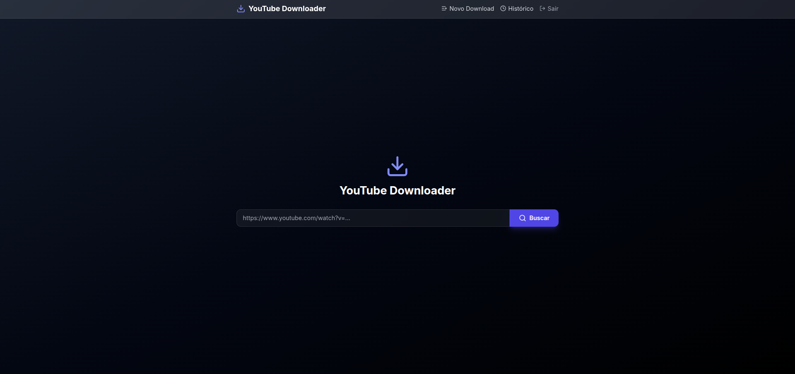

# YouTube Downloader

Uma aplicação web Django para download de vídeos e áudios do YouTube. O projeto utiliza `yt-dlp` nos bastidores e apresenta uma interface moderna construída com Tailwind CSS. 

Conta com uma arquitetura **Multi-Tenant** (Multilocatário), onde cada usuário possui seu próprio ambiente isolado de downloads e histórico.

---

## 📸 Capturas de Tela

<div align="center">
  
  <br><br>
  
  <br><br>
  
</div>

---

## 🚀 Funcionalidades

- **Download de Vídeo e Áudio**: Suporta extração apenas de áudio ou vídeo completo.
- **Múltiplas Qualidades**: Escolha entre diversas resoluções de vídeo (1080p, 720p, etc.) e qualidades de áudio.
- **Processamento em Background**: Downloads ocorrem em segundo plano (via *threading*) sem bloquear a interface.
- **Progresso em Tempo Real**: Acompanhamento visual do progresso do download via AJAX (*polling*).
- **Arquitetura Multi-Tenant**: Cada conta de usuário possui seu próprio `Tenant` exclusivo (URLs prefixadas com o `slug` do usuário). Histórico e arquivos são completamente isolados e seguros.
- **Interface Moderna**: UI limpa e responsiva utilizando **Tailwind CSS** (via CDN) e **Lucide Icons**.

---

## 🛠️ Tecnologias e Arquitetura

- **Backend**: Python 3.12+, Django 6.x
- **Frontend**: HTML5, Tailwind CSS, Vanilla JavaScript
- **Download Engine**: [yt-dlp](https://github.com/yt-dlp/yt-dlp)
- **Processamento de Mídia**: `ffmpeg`
- **Banco de Dados**: SQLite (Desenvolvimento) / PostgreSQL (Produção via `ENVIRONMENT=prd`)
- **Deploy**: Arquivos `Dockerfile` e `docker-compose.yml` prontos para orquestração de contêineres.

---

## ⚙️ Pré-requisitos

Para rodar o projeto, você precisará ter instalado em sua máquina:

1. **Python 3.12+** (Para execução local nativa)
2. **[FFmpeg](https://ffmpeg.org/download.html)**: Obrigatório pelo `yt-dlp` para mesclar áudio/vídeo e realizar conversões.
   - *Ubuntu/Debian*: `sudo apt install ffmpeg`
   - *MacOS*: `brew install ffmpeg`
   - *Windows*: Baixe o executável e adicione ao seu PATH.
3. **Docker e Docker Compose** (Opcional, mas altamente recomendado).

---

## 📦 Como Instalar e Rodar

> [!WARNING]
> **Atenção sobre o Banco de Dados:** O projeto verifica o valor da variável `ENVIRONMENT` no arquivo `.env`. Se você definir `ENVIRONMENT=prd`, o sistema tentará se conectar ao banco **PostgreSQL** (que requer configuração adicional). Qualquer outro valor fará com que a aplicação utilize o banco **SQLite** por padrão.

Você pode executar a aplicação diretamente no seu ambiente local ou através de Contêineres (Docker).

### Opção 1: Rodando com Docker (Recomendado)

A maneira mais rápida de subir a aplicação com todas as suas dependências sistêmicas (como o FFmpeg isolado no contêiner).

1. Clone o repositório e acesse a pasta:
   ```bash
   git clone https://github.com/renato-perussi/youtube_downloader.git
   cd youtube_downloader
   ```

2. Crie o arquivo de variáveis de ambiente:
   ```bash
   cp .env.example .env
   ```

3. Suba os contêineres:
   ```bash
   docker-compose up --build -d
   ```

4. Acesse `http://localhost:8000` no seu navegador!

### Opção 2: Rodando Localmente

1. Clone o repositório:
   ```bash
   git clone https://github.com/renato-perussi/youtube_downloader.git
   cd youtube_downloader
   ```

2. Crie e ative um ambiente virtual:
   ```bash
   python -m venv .venv
   source .venv/bin/activate  # No Windows: .venv\Scripts\activate
   ```

3. Instale as dependências Python:
   ```bash
   pip install -r requirements.txt
   ```

4. Configure as variáveis de ambiente:
   ```bash
   cp .env.example .env
   ```

5. Execute as migrações do banco de dados:
   ```bash
   python manage.py makemigrations
   python manage.py migrate
   ```

6. Inicie o servidor de desenvolvimento:
   ```bash
   python manage.py runserver
   ```

7. Acesse `http://localhost:8000` no seu navegador.

---

## 🧩 Estrutura do Projeto e Fluxo

O projeto é construído em torno da aplicação `ytdownloader`. 

### Fluxo de Download
1. **Busca**: O usuário envia uma URL do YouTube na tela inicial de seu tenant. A *view* extrai as informações do vídeo (título, thumb, durações, qualidades disponíveis) via `yt-dlp`, salva esses metadados na sessão e redireciona.
2. **Seleção**: Na tela de busca, o usuário escolhe se quer apenas Áudio ou Vídeo, e seleciona a resolução/qualidade desejada.
3. **Download**: Um registro `Download` é criado no banco de dados com status `pending`. Uma *Thread* do Python executa a função de download em segundo plano.
4. **Progresso**: O usuário é redirecionado para a tela de progresso. A página consulta um *endpoint* JSON a cada 500ms (`/<slug>/progress/<pk>/json/`) para atualizar a barra de progresso lendo os eventos emitidos pelo `yt-dlp` (via *progress_hooks*).
5. **Finalização**: Ao atingir 100%, o download é concluído, salvo na pasta `media/downloads/` e o usuário pode baixá-lo no seu dispositivo ou acessar o Histórico.

### Inquilinos (Multi-Tenant)
Ao registrar um novo `User`, um *Signal* (`post_save`) automaticamente cria uma instância do modelo `Tenant` vinculado a este usuário. O *slug* do Tenant baseia-se no *username*.
Todas as views que manipulam informações de downloads estendem a classe `TenantAwareMixin` que garante o isolamento dos dados — o usuário `/joao/` não pode visualizar os downloads e dados da rota `/maria/`.

---

## 💻 Comandos Úteis

**Criar um usuário Administrador (Superuser)**:
```bash
python manage.py createsuperuser
```

**Verificar logs da aplicação no Docker**:
```bash
docker-compose logs -f web
```

---

## 📄 Isenção de Responsabilidade e Licença

Este projeto foi desenvolvido **apenas para fins educacionais e de estudo sobre Django, processamento em background e arquitetura de software**. 

Verifique os termos de serviço do YouTube ou das plataformas relevantes antes de realizar o download de conteúdos de terceiros protegidos por direitos autorais. O uso indevido da ferramenta é de total responsabilidade do usuário final.
