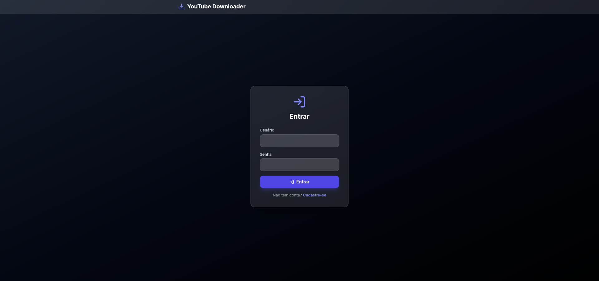
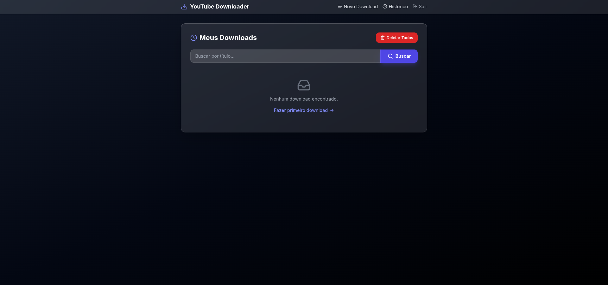

# YouTube Downloader

Aplicação Django multi-tenant para pesquisar, baixar e gerenciar vídeos/áudios do YouTube com `yt-dlp`, progresso em tempo real e histórico isolado por usuário.

    

## Sumário

- [Capturas de tela](#capturas-de-tela)
- [Funcionalidades](#funcionalidades)
- [Tecnologias](#tecnologias)
- [Arquitetura](#arquitetura)
- [Pré-requisitos](#pré-requisitos)
- [Quickstart](#quickstart)
- [Variáveis de ambiente](#variáveis-de-ambiente)
- [Testes e qualidade](#testes-e-qualidade)
- [Estrutura do projeto](#estrutura-do-projeto)
- [Fluxo de download](#fluxo-de-download)
- [Comandos úteis](#comandos-úteis)
- [Roadmap e melhorias sugeridas](#roadmap-e-melhorias-sugeridas)
- [Licença](#licença)

## Capturas de tela

<div align="center">
  
  <br><br>
  
  <br><br>
  
</div>

## Funcionalidades

- Download de vídeo (`mp4`, `webm`) e áudio (`mp3`, `wav`, `flac`).
- Múltiplas qualidades com validação cruzada formato x qualidade.
- Processamento em background via `threading` sem bloquear a UI.
- Progresso em tempo real com polling JSON a cada 500ms.
- Multi-tenant: cada `User` tem um `Tenant` com slug próprio e isolamento total.
- Histórico paginado com busca, detalhe, exclusão individual e em massa.
- Exportação ZIP de todos os concluídos.
- Mensagens de erro amigáveis sem vazar URLs assinadas.
- Admin Django configurado para `Tenant` e `Download`.

## Tecnologias

| Camada | Stack |
|---|---|
| Backend | Python 3.12, Django 6.0 |
| Download engine | `yt-dlp`, `ffmpeg`, Node.js (JS runtime) |
| Frontend | HTML5, Tailwind CSS via CDN, Lucide Icons, Vanilla JS |
| Banco | SQLite (dev/test), PostgreSQL 17 (prd) |
| Servidor | Gunicorn + WhiteNoise |
| Qualidade | Ruff (lint + format, aspas simples), Pytest + pytest-django |
| Deploy | Dockerfile multi-uso + Docker Compose com healthcheck |

## Arquitetura

Camadas com responsabilidade única e 100% Class-Based Views:

- `ytdownloader/models/` — `Tenant`, `Download`, `choices`, `DownloadQuerySet` (`for_tenant`, `completed`, `search`).
- `ytdownloader/forms/` — `SearchForm`, `DownloadForm` com `clean_quality`.
- `ytdownloader/services/` — `ytdlp` (integração), `downloads` (thread + progresso), `files` (tamanho + ZIP), `exceptions` (erros amigáveis).
- `ytdownloader/views/` — `auth`, `home`, `search`, `history`, `progress`, `files` + `mixins` (`TenantAwareMixin`, `SearchMixin`).
- `ytdownloader/signals.py` — cria `Tenant` no `post_save(User)` e remove arquivo no `post_delete(Download)`.
- `app/settings/` — `base`, `dev`, `prd`, `test` selecionados por `ENVIRONMENT`.
- `app/urls.py` + `ytdownloader/urls.py` — todas as rotas prefixadas por `<slug:slug>/`.

Rotas principais:

| Rota | View (CBV) |
|---|---|
| `/` | `RootRedirectView` |
| `/login_redirect/` | `LoginRedirectView` |
| `/accounts/register/` | `RegisterView` |
| `/<slug>/` | `DownloadCreateView` |
| `/<slug>/search/` | `SearchResultView` |
| `/<slug>/history/` | `DownloadHistoryView` |
| `/<slug>/detail/<pk>/` | `DownloadDetailView` |
| `/<slug>/delete/<pk>/` | `DownloadDeleteView` |
| `/<slug>/download/<pk>/` | `ServeDownloadView` |
| `/<slug>/progress/<pk>/` | `DownloadProgressView` |
| `/<slug>/progress/<pk>/json/` | `DownloadProgressJsonView` |
| `/<slug>/download-all/` | `DownloadAllView` |
| `/<slug>/delete-all/` | `DownloadDeleteAllView` |

## Pré-requisitos

- Python 3.12+ e `ffmpeg` para execução local.
- Node.js 18+ recomendado (runtime JS do `yt-dlp`, evita fallback).
- Docker + Docker Compose para execução conteinerizada.

## Quickstart

### Opção 1 — Docker (recomendado)

```bash
git clone https://github.com/renato-perussi/youtube_downloader.git
cd youtube_downloader
cp .env.example .env
docker compose -f docker-compose.yml up --build
```

Acesse `http://localhost:8000`.

O `entrypoint.sh` executa apenas `migrate` + `collectstatic` (sem `makemigrations` em produção) e sobe o Gunicorn com 3 workers. O serviço `db` possui healthcheck com `pg_isready` e o `web` aguarda o banco saudável. O healthcheck do `web` consulta `/healthz/` que valida o banco.

Para desenvolvimento local com bind mount e `runserver`, use o override (SQLite):

```bash
docker compose up --build
```

### Opção 2 — Local

```bash
git clone https://github.com/renato-perussi/youtube_downloader.git
cd youtube_downloader
python -m venv .venv
source .venv/bin/activate
pip install -r requirements.txt
pip install -r requirements-dev.txt
cp .env.example .env
python manage.py migrate
python manage.py runserver
```

> `ENVIRONMENT=prd` ativa PostgreSQL. Qualquer outro valor usa SQLite. `ENVIRONMENT=test` usa SQLite em memória para o Pytest.

## Variáveis de ambiente

| Var | Exemplo | Descrição |
|---|---|---|
| `SECRET_KEY` | `openssl rand -hex 32` | Chave do Django (>=32 chars, obrigatória em prod) |
| `DEBUG` | `False` | Debug local (nunca `True` em prod) |
| `ALLOWED_HOSTS` | `localhost,127.0.0.1` | Hosts permitidos |
| `ENVIRONMENT` | `prd` | `dev`/`prd`/`test` |
| `POSTGRES_DB` | `ytdownloader` | Banco prod |
| `POSTGRES_USER` | `postgres` | Usuário prod |
| `POSTGRES_PASSWORD` | `postgres` | Senha prod |
| `POSTGRES_HOST` | `db` | Host prod (Compose usa `db`) |
| `POSTGRES_PORT` | `5432` | Porta prod |
| `SECURE_SSL_REDIRECT` | `False` | `True` apenas atrás de proxy TLS |
| `SESSION_COOKIE_SECURE` | `False` | `True` com HTTPS |
| `CSRF_COOKIE_SECURE` | `False` | `True` com HTTPS |
| `SECURE_HSTS_SECONDS` | `0` | `31536000` com HTTPS válido |

## Testes e qualidade

Ferramentas: `ruff` substitui `black` + `blue` + `flake8` + `isort` (removidos do `requirements-dev.txt` para evitar conflito).

```bash
source .venv/bin/activate
ruff check .
ruff format --check .
pytest
pytest --cov
python manage.py check
python manage.py migrate
```

Padrões adotados:

- 100% Class-Based Views, sem function-based views.
- Aspas simples em todo o código Python (`ruff format` com `quote-style = 'single'`).
- Camada `services/` pura e testável, views finas.
- 67 testes Pytest cobrindo modelos, formulários, serviços, segurança anti-SSRF e views com isolamento multi-tenant.
- Hardening: whitelist YouTube, limite 2h/concorrência 2, erros sem vazar URLs, `SECURE_*` em prod, `/healthz/` com check de banco.
- Correções pós-auditoria: `SECRET_KEY` forte exigida em prod, slug único com sufixo, semáforo tratado na view (sem 500), validação também na camada `services`, ZIP limitado a 500MB com `DEFLATED`.
- Concorrência segura: `outtmpl` único por `download_id`, revalidação de duração/live no POST direto, sem arquivos órfãos.

## Estrutura do projeto

```text
app/
  settings/{base,dev,prd,test}.py  # config por ENVIRONMENT
  urls.py                           # RootRedirectView + includes
  wsgi.py / asgi.py
ytdownloader/
  models/{tenant,download,choices}.py
  forms/{search,download}.py
  services/{ytdlp,downloads,files,exceptions}.py
  views/{auth,home,search,history,progress,files,mixins}.py
  signals.py
  context_processors.py
  admin.py
  urls.py
  templates/
  tests/                            # pytest-django
Dockerfile                          # python:3.12-slim + ffmpeg + node + gunicorn
docker-compose.yml                  # web + postgres:17-alpine com healthcheck
entrypoint.sh                       # migrate + collectstatic + exec
pyproject.toml                      # ruff + pytest + coverage
```

## Fluxo de download

1. POST `action=search` em `/<slug>/` extrai metadados via `yt-dlp`, salva na sessão e redireciona para `search/`.
2. GET `search/` exibe `DownloadForm` com URL oculta.
3. POST `action=download` cria `Download(status=processing)` e dispara thread daemon com `progress_hooks`.
4. Página `progress/<pk>/` faz polling em `progress/<pk>/json/` a cada 500ms.
5. Sucesso marca `completed/progress=100` com arquivo em `media/downloads/`; falha marca `failed` com mensagem segura.

## Comandos úteis

```bash
python manage.py createsuperuser
python manage.py migrate
docker compose logs -f web
docker compose exec web python manage.py createsuperuser
```

## Roadmap e melhorias sugeridas

- Trocar `threading` por Celery + Redis para escala horizontal e retry persistente.
- Adicionar Django REST Framework com throttling por tenant.
- Cache de metadados (Redis) para URLs repetidas.
- WebSocket (Channels) em vez de polling para progresso.
- Rate-limit e validação de duração/tamanho máximo por plano.
- Armazenamento S3-compatível para arquivos em produção.
- CI com GitHub Actions (`ruff`, `pytest --cov`, `docker build`).
- Observabilidade: Sentry + logs estruturados + métricas Prometheus.
- Testes E2E com Playwright no fluxo busca → download → ZIP.

## Licença

Projeto educacional para portfólio focado em Django, background processing e arquitetura limpa.

Respeite os Termos de Serviço do YouTube e direitos autorais. O uso indevido é responsabilidade do usuário final.
